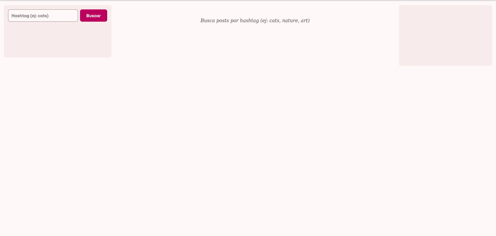
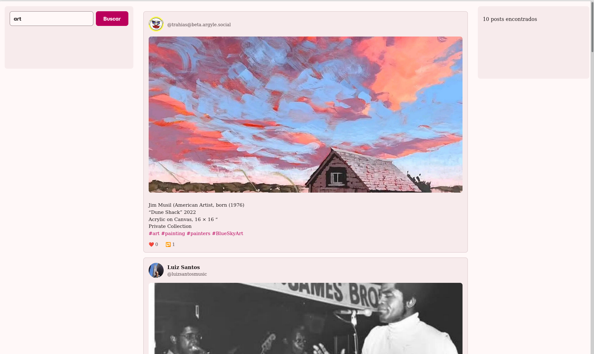

# Mastodoneando

Explorador educativo de la API de Mastodon que permite buscar y visualizar posts por hashtag. Este proyecto demuestra cómo realizar llamadas asíncronas a una API REST y construir una interfaz de usuario interactiva y reactiva con Angular.

## Descripción del Proyecto

 La aplicación permite a los usuarios buscar posts de Mastodon introduciendo un hashtag, y visualizar los resultados en una galería de posts.

### Consulta

La aplicación consulta la API pública de Mastodon (específicamente la instancia mastodon.social) utilizando el endpoint `GET /api/v1/timelines/tag/:hashtag`. Cuando un usuario introduce un hashtag (por ejemplo, "cats", "nature" o "photography"), la aplicación:

1. Realiza una petición HTTP a la API de Mastodon
2. Filtra los posts para mostrar únicamente aquellos que contienen imágenes
3. Presenta los 10 primeros resultados en una galería visualmente atractiva
4. Muestra información relevante de cada post: autor, avatar, contenido, imagen y estadísticas

## API Externa
- **Mastodon API**: API REST pública de Mastodon (https://docs.joinmastodon.org/methods/timelines/#tag)
- **Endpoint utilizado**: `/api/v1/timelines/tag/:hashtag`
- **Instancia**: mastodon.social

## Componentes

**App (Componente Principal)**
- Orquesta la comunicación entre el componente de búsqueda y la galería de posts
- Gestiona el estado global usando signals: `posts`, `loading` y `error`
- Inyecta el servicio MastodonService para realizar las consultas a la API
- Implementa manejo de estados (carga, error, vacío) para mejorar la experiencia de usuario

**SearchBox (Componente de Búsqueda)**
- Proporciona un input de texto para introducir el hashtag
- Emite eventos cuando el usuario realiza una búsqueda (Enter o botón)
- Utiliza two-way binding con `[(ngModel)]` para capturar el input del usuario
- Integrado en el sidebar izquierdo del layout

**Post (Componente de Tarjeta)**
- Recibe los datos de un post individual mediante `input()` signals
- Muestra la información del autor (avatar, nombre, username)
- Renderiza la imagen del post con su descripción alternativa
- Presenta el contenido HTML del post de forma segura
- Muestra estadísticas de interacción (favoritos y reblogs)

### Servicios

**MastodonService**
- Encapsula toda la lógica de comunicación con la API de Mastodon
- Método `getPostsByHashtag(hashtag: string)`: Consulta posts por hashtag
- Implementa filtrado para mostrar solo posts con imágenes
- Utiliza operadores RxJS (`map`) para transformar los datos recibidos
- Retorna Observables para permitir suscripciones reactivas
- Configura la instancia base como `mastodon.social`

**Variables CSS y Material Design 3**
- `_variables.scss`: Define tokens de diseño reutilizables (fuentes, espaciados, radios)
- `_theme.scss`: Configura el tema de Angular Material con paletas de color y tipografía
- Uso de variables CSS del sistema Material (`--mat-sys-surface`, `--mat-sys-primary`, etc.)

## Resultados

### Interfaz Principal

*Vista general de la aplicación con el layout de tres columnas y el componente de búsqueda*

### Loading

*Búsqueda realizada con el hashtag "art" mostrando el mensaje de Loading mientras carga*

### Galeria de Post

*Galería cargada con los post traidos de la API con el hashtag art*

